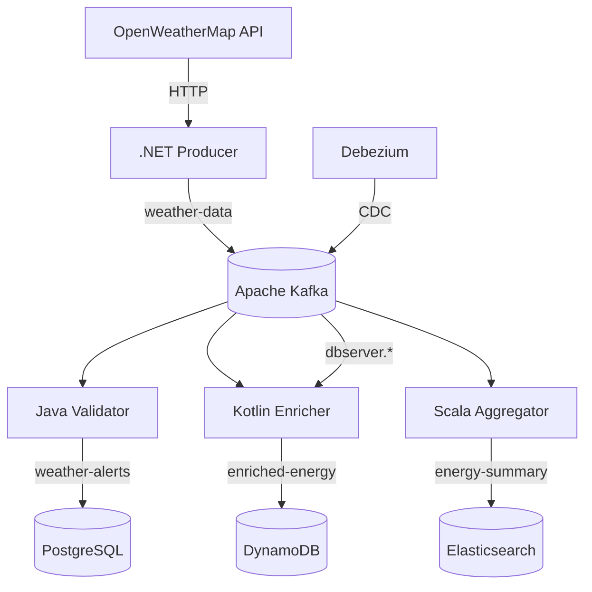

# Kafka Showcase: Multi-Language Event-Driven Architecture

A demonstration platform showcasing **Apache Kafka** integration with .NET, Java, Kotlin, and Scala services, featuring real-time data pipelines and cross-database synchronization.

## Key Features
- 🌐 **Multi-language Services**: .NET (producer), Java/Kotlin/Scala (consumers)
- ⚡ **Real-Time Weather Analytics**: From data collection to energy predictions
- 🔄 **CDC with Debezium**: PostgreSQL → Kafka → DynamoDB synchronization
- 📊 **Stream Processing**: Kafka Streams for temporal aggregations
- 🛢️ **Polyglot Persistence**: PostgreSQL, MongoDB, DynamoDB integration

## Architecture Overview

## Services Breakdown

### 1. .NET Producer Service
**Responsibility**: Weather data collection  

**Tech Stack**: 
- ASP.NET Core
- Kafka
- OpenWeatherMap API

### 2. Java Validation Service
**Responsibility**: Extreme weather detection  
**Tech Stack**:
- Spring Boot 3
- Kafka Streams
- PostgreSQL

### 3. Kotlin Enrichment Service
**Responsibility**: Solar energy predictions  
**Tech Stack**:
- Kotlin 
- DynamoDB
- Kafka Streams
  
### 4. Scala Analytics Service
**Responsibility**: Temporal aggregations  
**Tech Stack**:
- Scala 
- Kafka Streams
- Alpakka Elasticsearch

## Database Integration

| Database     | Service      | Use Case                          | Schema Example                     |
|--------------|--------------|-----------------------------------|------------------------------------|
| PostgreSQL   | Java         | Weather alerts storage            | `Alert(id, type, location, value)` |
| DynamoDB     | Kotlin       | Energy profile repository         | `EnergyProfile(city, ghi, epoch)` |
| MongoDB      | .NET         | Raw data audit logs               | `WeatherRaw(json, timestamp)`     |

