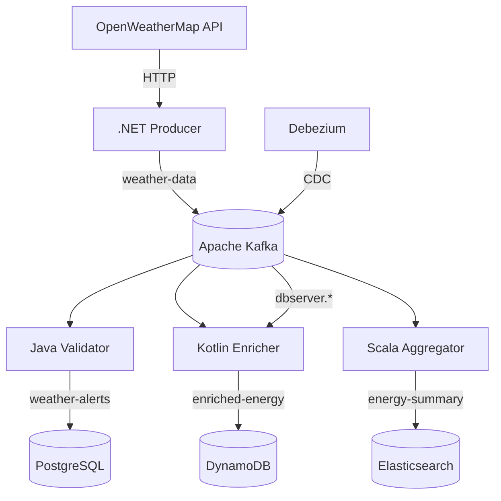

# Kafka Showcase Repository Documentation

## Overview

This repository contains a demonstration platform that highlights the integration of **Apache Kafka** with services developed in various programming languages (.NET, Java, Kotlin, and Scala), featuring real-time data pipelines and synchronization between different databases.

## Key Features

- 🌐 **Multi-language Services**: .NET (producer), Java/Kotlin/Scala (consumers)
- ⚡ **Real-time Weather Analytics**: From data collection to energy predictions
- 🔄 **CDC with Debezium**: PostgreSQL → Kafka → DynamoDB synchronization
- 📊 **Stream Processing**: Kafka Streams for temporal aggregations
- 🛢️ **Polyglot Persistence**: Integration between PostgreSQL, MongoDB, and DynamoDB

## Architecture

The project follows an event-driven architecture where:

1. The .NET producer service collects weather data
2. Events are published to Apache Kafka
3. Various consumers process the data for different purposes:
   - Data validation (Java)
   - Data enrichment (Kotlin)
   - Analysis and aggregation (Scala)
4. Results are stored in different databases

## Services

### 1. .NET Producer Service (WeatherRadar)

**Responsibility**: Weather data collection

**Features**:
- Generation of simulated weather data
- Publication of events to Kafka
- Storage of raw data in MongoDB
- Implementation of idempotency with DynamoDB

**Structure**:
- `WeatherRadar.Domain`: Entities and domain interfaces
- `WeatherRadar.Application`: Application logic and contracts
- `WeatherRadar.Infra`: Infrastructure implementations (Kafka, DynamoDB, MongoDB)
- `WeatherRadar.Producer`: Console application that executes the production cycle

### 2. Java Validator Service (Weather Validator)

**Responsibility**: Detection of weather anomalies

**Features**:
- Consumption of events from Kafka
- Data validation according to meteorological rules
- Detection of anomalous or extreme conditions
- Storage of alerts in PostgreSQL

**Key Components**:
- Rules engine for weather data validation
- Idempotency system to ensure unique processing
- Repositories for data and anomaly storage

## Infrastructure

The `/infra` directory contains Docker configurations to run locally:

- **Kafka**: Event streaming platform
- **DynamoDB Local**: For idempotency management
- **MongoDB**: For raw data storage
- **PostgreSQL**: For weather data and alerts storage

The `docker-compose.yml` file allows starting the entire environment with a single command.

## Data Flow
.NET service generates weather data
Data is stored in MongoDB (audit)
Events are published to Kafka with idempotency keys
Java service consumes events and validates data
Detected anomalies are stored in PostgreSQL
Kotlin service [pending] makes energy predictions
Scala service [pending] performs temporal aggregations

## Technical Features

### Idempotency
The project implements idempotency at two levels:
- In the .NET producer using DynamoDB
- In the Java consumer by checking already processed steps

### Validation
The Java service implements validation rules such as:
- Verification of values outside possible physical ranges
- Detection of extreme temperature and humidity combinations
- Classification of anomalies by severity

### Databases
Each service uses the most appropriate database for its use case:
- **MongoDB**: Raw data storage for auditing
- **PostgreSQL**: Structured data and alerts
- **DynamoDB**: Idempotency control and processing

## How to Run

1. Start the infrastructure with Docker Compose:

cd infra/local-dev
docker-compose up -d

2. Run the .NET producer service:

cd services/dotnet-producer-weather
dotnet run --project src/WeatherRadar.Producer

3. Run the Java validator service:

cd services/java-weather-validator
./mvnw spring-boot:run

## Project Status

- ✅ .NET Producer Service (complete - mocking weather api for now)
- ✅ Java Validator Service (complete)
- 🚧 Kotlin Enrichment Service (pending)
- 🚧 Scala Analytics Service (pending)

## Debezium Integration (CDC)

The project envisions the implementation of Change Data Capture (CDC) with Debezium to synchronize data from PostgreSQL to Kafka, allowing other services to react to database changes without direct coupling.

---

 
